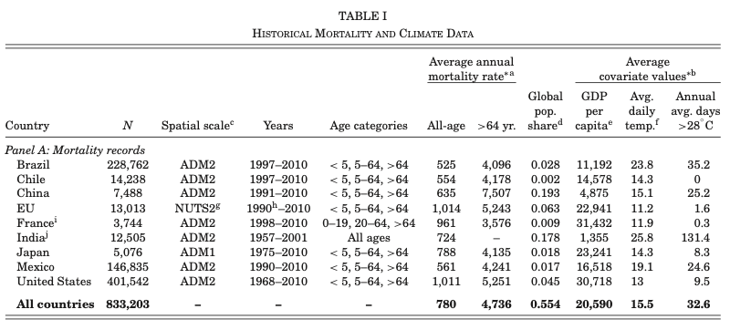
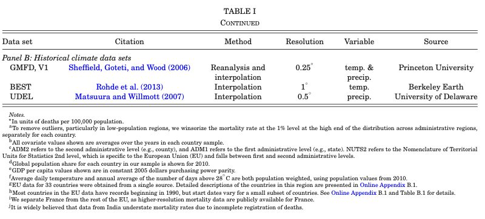

# Replication results: What we obtained

This page is dedicated to the discussion of the results we managed to replicate.

In the context of the class requirements, we where asked to choose key exhibits from the article, and to write each replicated exhibit together with an explanation for how they were obtained, what they meant, and what the underlying and identifying assumptions were for the interpretation given by the authors. 

Given the already mentioned technical difficulties we encountered, we decided to decrease the number of replication targets. At the moment, the current page describes Table 1, Figure 1, and Figure 2.
In the following subsections, you will find a presentation of the original exhibit, a presentation of our replication results, and a comment on the differences between the original and replicated figures.

```@contents
Pages = ["description_results.md"]
Depth = 3
```

## Table 1: Historical mortality and climate data

### Description of original exhibit

The Table 1 of the article is a descriptive statistics table of historical mortality and climate data. 
Its goal is to give an overview on the data used by the authors to perform their analysis. 
It is divided in two parts: 

- Panel A: Mortality records
- Panel B: Historical climate data sets

The Panel A part of the table describes the mortality rate of different countries, for different age categories. It also gives supplementary information on economic production, depending on the country.
It includes several columns, corresponding to different variables of their cleaned dataset, among which we can find:

- Country,
- Number of observations,
- Spatial scale,
- Years, 
- Age categories,
- Average annual mortality rate,
- Average covariate values

The Panel B part of the table includes several variables, among which the dataset they refer to, their citation, their method of the dataset (reanalysis and interpolation or just interpolation), their resolution in terms of celsius degrees, the variables they contain, and their institutional source.

We focus here only on the panel A part of the table. Essentially, the authors took different national datasets and provide a brief description for each one of them. 
The countries presented are Brazil, Chile, China, European Union, France, India, Japan, Mexico, and the United States. One last line correspond to "all countries" and is an aggregate of the listed countries.

The number of observations variable correspond...

The spatial scale variable correspond...
can take several values...

The years variable correspond to the years of beginning and of end of the observations. They differ in function of the countries...

The age categories variable presents the different age categories listed in each one of the national dataset. The Indian dataset does not have detailed information on age category and includes all ages only.
The French dataset age categories has a different age categorization than the other national datasets, and divides its age category among: 0-19 years, 20-64 years, and more than 64 years.
For all of other countries, the age categories are: 

- 0-5 years, 
- 5-64 years,
- more than 64 years.

The average annual mortality rate variable is presented in function of two age categories: all-age, and for more than 64 years, except for the Indian dataset, for which only the all-age average annual mortality rate is displayed. It is given in units of deaths per 100,000 population. The mortality rate was obtained after excluding values that were above the 99th percentile, and replacing them with the 99th percentile value.







The table 1 was originally not defined as a replication target, since the requirements of the class mentioned the non-descriptive characteristic of the exhibit.
However, we chose to include a fraction of it it as an intermediary step for our replication efforts, to make sure that we were working on the same data. 
After verification, the average covariate values (GDP and temperature) were also generally coherent with the data of the authors, but were not included in the replication result.

### Presentation of the replication result

Our replication attempt for the table 1 can be obtained with the [`Replication_Carleton_et_al_2022.create_table_1()`](@ref) function, and resulted in the table displayed just below.

```@raw html
<div>
<div style = "float: left;"><span>8×8 DataFrame</span></div><div style = "clear: both;">
</div>
</div>
<div class = "data-frame" style = "overflow-x: scroll;"><table class = "data-frame" style = "margin-bottom: 6px;">
<thead>
<tr class = "header">
<th class = "rowNumber" style = "font-weight: bold; text-align: right;">Row</th>
<th style = "text-align: left;">countries</th>
<th style = "text-align: left;">population size</th>
<th style = "text-align: left;">spatial scale</th>
<th style = "text-align: left;">years</th>
<th style = "text-align: left;">age categories</th>
<th style = "text-align: left;">mortality rate for all age categories</th>
<th style = "text-align: left;">mortality rate for more than 64 yr individuals</th>
<th style = "text-align: left;">global population share</th>
</tr>

</thead><tbody><tr><td class = "rowNumber" style = "font-weight: bold; text-align: right;">1</td><td style = "text-align: left;">BRA</td><td style = "text-align: left;">228762</td><td style = "text-align: left;">ADM2</td><td style = "text-align: left;">(1997, 2010)</td><td style = "text-align: left;">0-4, 5-64, 65+</td><td style = "text-align: left;">525.5</td><td style = "text-align: left;">4095.9</td><td style = "text-align: left;">0.028</td></tr><tr><td class = "rowNumber" style = "font-weight: bold; text-align: right;">2</td><td style = "text-align: left;">CHL</td><td style = "text-align: left;">14238</td><td style = "text-align: left;">ADM2</td><td style = "text-align: left;">(1997, 2010)</td><td style = "text-align: left;">0-4, 5-64, 65+</td><td style = "text-align: left;">554.3</td><td style = "text-align: left;">4177.8</td><td style = "text-align: left;">0.002</td></tr><tr><td class = "rowNumber" style = "font-weight: bold; text-align: right;">3</td><td style = "text-align: left;">EU</td><td style = "text-align: left;">15475</td><td style = "text-align: left;">NUTS2</td><td style = "text-align: left;">(1990, 2010)</td><td style = "text-align: left;">0-4, 5-64, 65+</td><td style = "text-align: left;">1043.1</td><td style = "text-align: left;">7260.1</td><td style = "text-align: left;">0.0</td></tr><tr><td class = "rowNumber" style = "font-weight: bold; text-align: right;">4</td><td style = "text-align: left;">FRA</td><td style = "text-align: left;">3744</td><td style = "text-align: left;">ADM2</td><td style = "text-align: left;">(1998, 2010)</td><td style = "text-align: left;">0-19, 20-64, 65+</td><td style = "text-align: left;">959.9</td><td style = "text-align: left;">3575.7</td><td style = "text-align: left;">0.009</td></tr><tr><td class = "rowNumber" style = "font-weight: bold; text-align: right;">5</td><td style = "text-align: left;">JPN</td><td style = "text-align: left;">5076</td><td style = "text-align: left;">ADM2</td><td style = "text-align: left;">(1975, 2010)</td><td style = "text-align: left;">0-4, 5-64, 65+</td><td style = "text-align: left;">788.1</td><td style = "text-align: left;">4135.0</td><td style = "text-align: left;">0.018</td></tr><tr><td class = "rowNumber" style = "font-weight: bold; text-align: right;">6</td><td style = "text-align: left;">MEX</td><td style = "text-align: left;">146853</td><td style = "text-align: left;">ADM2</td><td style = "text-align: left;">(1990, 2010)</td><td style = "text-align: left;">0-4, 5-64, 65+</td><td style = "text-align: left;">570.0</td><td style = "text-align: left;">4316.8</td><td style = "text-align: left;">0.017</td></tr><tr><td class = "rowNumber" style = "font-weight: bold; text-align: right;">7</td><td style = "text-align: left;">IND</td><td style = "text-align: left;">11311</td><td style = "text-align: left;">ADM2</td><td style = "text-align: left;">(1957, 2001)</td><td style = "text-align: left;">ALL</td><td style = "text-align: left;">743.7</td><td style = "font-style: italic; text-align: left;">missing</td><td style = "text-align: left;">0.178</td></tr><tr><td class = "rowNumber" style = "font-weight: bold; text-align: right;">8</td><td style = "text-align: left;">Global</td><td style = "text-align: left;">425459</td><td style = "text-align: left;"> </td><td style = "text-align: left;">(&quot; &quot;, &quot; &quot;)</td><td style = "text-align: left;"> </td><td style = "text-align: left;">582.2</td><td style = "text-align: left;">4291.4</td><td style = "text-align: left;">0.253</td></tr></tbody></table></div>
```

The data of China and the U.S. not being available for the replication (the auhtors had a commercial agreement with companies holding the data), we omitted them from our replication attempt.

The first remark we can do about our replication result is that it broadly replicates the results of the authors. Some data is slightly different than what the authors present, notably the population size of the European Union (by approximately 3,000) and of Mexico (by 18). Since we did not include China and the U.S., our "Global" results also shown expected different results at each variable.

Regarding the average annual mortality rate, the differences are: 

- EU: about 30 for the whole population, about 2000 for the more than 64 years old. 
- France: about 2 for the whole population, about 1 for the more than 64 years old.
- India: about 19 for the whole population.
- Mexico: about 9 for the whole population, about 70 for the more than 64 years old.

For the global population share, we do not note any difference, except for the European Union.

Finally, we chose to produce the output in an HTML format, since the PDF format would require the user to have a distribution of $\LaTeX$ installed.
The replication user can still produce a PDF using the [`Replication_Carleton_et_al_2022.old_create_table_1()`](@ref) function.

## Figure 1: Mortality and temperature relationship

### Original exhibit

### Replication result

## Figure 2: Heatmap...

### Original exhibit

### Replication result


3/ Please choose five key exhibits that summarize the whole argument of the paper, i.e. from descriptives to reduced form to structural estimates (if applicable).

4/ Replicate them using another statistical software, and note any difference with the orginal (exact replication is not always possible, it is fine).

5/ Write each replicated exhibit together with an explanation for 
how they are obtained (e.g. estimating equation, optimization method etc.), 
what the exhibit means, 
and what the underlying/ identifying assumptions are for the interpretation given by the authors. Everything in a pdf of 10 pages maximum.

