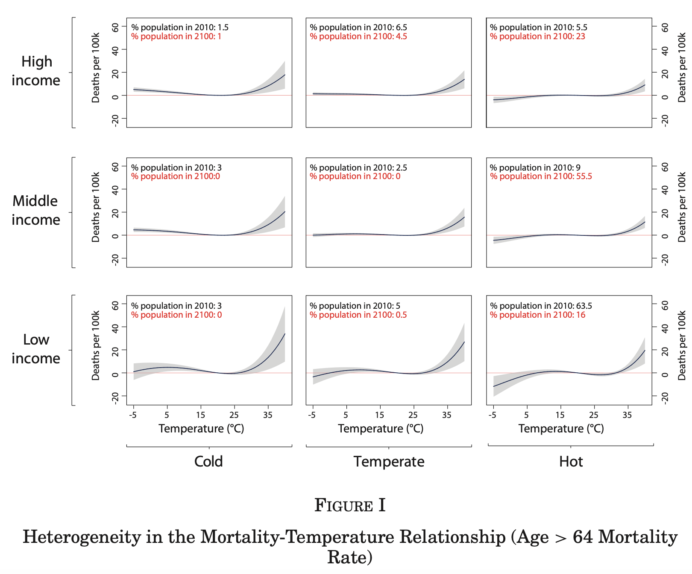
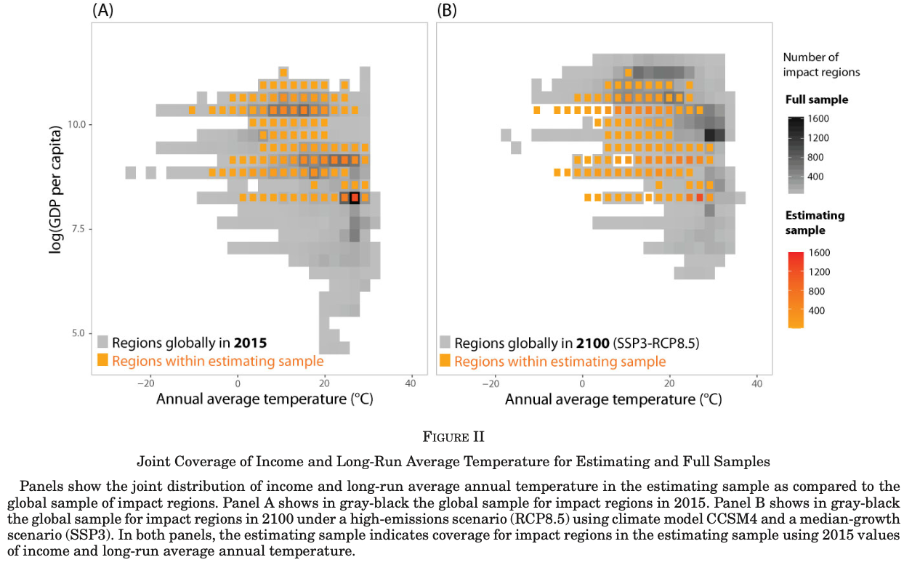
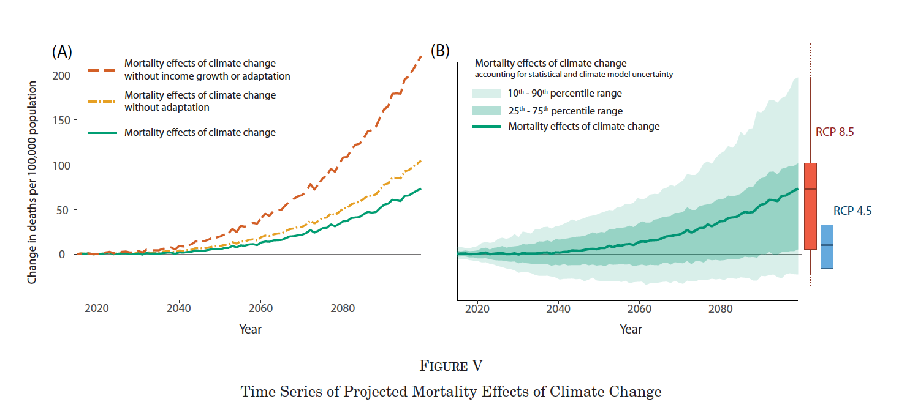

# Replication results: What we obtained

This page is dedicated to the discussion of the results we managed to replicate.

In the context of the class requirements, we where asked to choose key exhibits from the article, and to write each replicated exhibit together with an explanation for how they were obtained, what they meant, and what the underlying and identifying assumptions were for the interpretation given by the authors. 

Given the already mentioned technical difficulties we encountered, we decided to decrease the number of replication targets. At the moment, the current page describes Table 1, Figure 1, and Figure 2.
In the following subsections, you will find a presentation of the original exhibit, a presentation of our replication results, and a comment on the differences between the original and replicated figures.

```@contents
Pages = ["description_results.md"]
Depth = 3
```

## Table 1: Historical mortality and climate data

### Description of original exhibit

The Table 1 of the article is a descriptive statistics table of historical mortality and climate data. 
Its goal is to give an overview on the data used by the authors to perform their analysis. 
It is divided in two parts: 

- Panel A: Mortality records
- Panel B: Historical climate data sets

The Panel A part of the table describes the mortality rate of different countries, for different age categories. It also gives supplementary information on economic production, depending on the country.
It includes several columns, corresponding to different variables of their cleaned dataset, among which we can find:

- Country,
- Number of observations,
- Spatial scale,
- Years, 
- Age categories,
- Average annual mortality rate,
- Average covariate values

The Panel B part of the table includes several variables, among which the dataset they refer to, their citation, their method of the dataset (reanalysis and interpolation or just interpolation), their resolution in terms of celsius degrees, the variables they contain, and their institutional source.

We focus here only on the panel A part of the table. Essentially, the authors took different national datasets and provide a brief description for each one of them. 
The countries presented are Brazil, Chile, China, European Union, France, India, Japan, Mexico, and the United States. One last line correspond to "all countries" and is an aggregate of the listed countries.

The age categories variable presents the different age categories listed in each one of the national dataset. The Indian dataset does not have detailed information on age category and includes all ages only.
The French dataset age categories has a different age categorization than the other national datasets, and divides its age category among: 0-19 years, 20-64 years, and more than 64 years.
For all of other countries, the age categories are: 

- 0-5 years, 
- 5-64 years,
- more than 64 years.

The average annual mortality rate variable is presented in function of two age categories: all-age, and for more than 64 years, except for the Indian dataset, for which only the all-age average annual mortality rate is displayed. It is given in units of deaths per 100,000 population. The mortality rate was obtained after excluding values that were above the 99th percentile, and replacing them with the 99th percentile value.


The table 1 was originally not defined as a replication target, since the requirements of the class mentioned the non-descriptive characteristic of the exhibit.
However, we chose to include a fraction of it it as an intermediary step for our replication efforts, to make sure that we were working on the same data. 
After verification, the average covariate values (GDP and temperature) were also generally coherent with the data of the authors, but were not included in the replication result.

### Presentation of the replication result

Our replication attempt for the table 1 can be obtained with the [`Replication_Carleton_et_al_2022.create_table_1()`](@ref) function, and resulted in the table displayed just below.

```@raw html
<div>
<div style = "float: left;"><span>8×8 DataFrame</span></div><div style = "clear: both;">
</div>
</div>
<div class = "data-frame" style = "overflow-x: scroll;"><table class = "data-frame" style = "margin-bottom: 6px;">
<thead>
<tr class = "header">
<th class = "rowNumber" style = "font-weight: bold; text-align: right;">Row</th>
<th style = "text-align: left;">countries</th>
<th style = "text-align: left;">population size</th>
<th style = "text-align: left;">spatial scale</th>
<th style = "text-align: left;">years</th>
<th style = "text-align: left;">age categories</th>
<th style = "text-align: left;">mortality rate for all age categories</th>
<th style = "text-align: left;">mortality rate for more than 64 yr individuals</th>
<th style = "text-align: left;">global population share</th>
</tr>

</thead><tbody><tr><td class = "rowNumber" style = "font-weight: bold; text-align: right;">1</td><td style = "text-align: left;">BRA</td><td style = "text-align: left;">228762</td><td style = "text-align: left;">ADM2</td><td style = "text-align: left;">(1997, 2010)</td><td style = "text-align: left;">0-4, 5-64, 65+</td><td style = "text-align: left;">525.5</td><td style = "text-align: left;">4095.9</td><td style = "text-align: left;">0.028</td></tr><tr><td class = "rowNumber" style = "font-weight: bold; text-align: right;">2</td><td style = "text-align: left;">CHL</td><td style = "text-align: left;">14238</td><td style = "text-align: left;">ADM2</td><td style = "text-align: left;">(1997, 2010)</td><td style = "text-align: left;">0-4, 5-64, 65+</td><td style = "text-align: left;">554.3</td><td style = "text-align: left;">4177.8</td><td style = "text-align: left;">0.002</td></tr><tr><td class = "rowNumber" style = "font-weight: bold; text-align: right;">3</td><td style = "text-align: left;">EU</td><td style = "text-align: left;">15475</td><td style = "text-align: left;">NUTS2</td><td style = "text-align: left;">(1990, 2010)</td><td style = "text-align: left;">0-4, 5-64, 65+</td><td style = "text-align: left;">1043.1</td><td style = "text-align: left;">7260.1</td><td style = "text-align: left;">0.0</td></tr><tr><td class = "rowNumber" style = "font-weight: bold; text-align: right;">4</td><td style = "text-align: left;">FRA</td><td style = "text-align: left;">3744</td><td style = "text-align: left;">ADM2</td><td style = "text-align: left;">(1998, 2010)</td><td style = "text-align: left;">0-19, 20-64, 65+</td><td style = "text-align: left;">959.9</td><td style = "text-align: left;">3575.7</td><td style = "text-align: left;">0.009</td></tr><tr><td class = "rowNumber" style = "font-weight: bold; text-align: right;">5</td><td style = "text-align: left;">JPN</td><td style = "text-align: left;">5076</td><td style = "text-align: left;">ADM2</td><td style = "text-align: left;">(1975, 2010)</td><td style = "text-align: left;">0-4, 5-64, 65+</td><td style = "text-align: left;">788.1</td><td style = "text-align: left;">4135.0</td><td style = "text-align: left;">0.018</td></tr><tr><td class = "rowNumber" style = "font-weight: bold; text-align: right;">6</td><td style = "text-align: left;">MEX</td><td style = "text-align: left;">146853</td><td style = "text-align: left;">ADM2</td><td style = "text-align: left;">(1990, 2010)</td><td style = "text-align: left;">0-4, 5-64, 65+</td><td style = "text-align: left;">570.0</td><td style = "text-align: left;">4316.8</td><td style = "text-align: left;">0.017</td></tr><tr><td class = "rowNumber" style = "font-weight: bold; text-align: right;">7</td><td style = "text-align: left;">IND</td><td style = "text-align: left;">11311</td><td style = "text-align: left;">ADM2</td><td style = "text-align: left;">(1957, 2001)</td><td style = "text-align: left;">ALL</td><td style = "text-align: left;">743.7</td><td style = "font-style: italic; text-align: left;">missing</td><td style = "text-align: left;">0.178</td></tr><tr><td class = "rowNumber" style = "font-weight: bold; text-align: right;">8</td><td style = "text-align: left;">Global</td><td style = "text-align: left;">425459</td><td style = "text-align: left;"> </td><td style = "text-align: left;">(&quot; &quot;, &quot; &quot;)</td><td style = "text-align: left;"> </td><td style = "text-align: left;">582.2</td><td style = "text-align: left;">4291.4</td><td style = "text-align: left;">0.253</td></tr></tbody></table></div>
```

The data of China and the U.S. not being available for the replication (the auhtors had a commercial agreement with companies holding the data), we omitted them from our replication attempt.

The first remark we can do about our replication result is that it broadly replicates the results of the authors. Some data is slightly different than what the authors present, notably the population size of the European Union (by approximately 3,000) and of Mexico (by 18). Since we did not include China and the U.S., our "Global" results also shown expected different results at each variable.

Regarding the average annual mortality rate, the differences are: 

- EU: about 30 for the whole population, about 2000 for the more than 64 years old. 
- France: about 2 for the whole population, about 1 for the more than 64 years old.
- India: about 19 for the whole population.
- Mexico: about 9 for the whole population, about 70 for the more than 64 years old.

For the global population share, we do not note any difference, except for the European Union.

Finally, we chose to produce the output in an HTML format, since the PDF format would require the user to have a distribution of $\LaTeX$ installed.
The replication user can still produce a PDF using the [`Replication_Carleton_et_al_2022.old_create_table_1()`](@ref) function.

## Figure 1: Mortality and temperature relationship

### Original exhibit

The figure 1 is derived from the empirical estimation of a regression model that examines the relationship between mortality rates and temperature, accounting for heterogeneity due to income and climate. The specific steps and equations used to obtain this figure are as follows:

1. Data Collection:
   - Mortality Data: Collected from 40 countries, covering 38% of the global population. The data includes age-specific annual mortality rates for three age categories: <5, 5-64, and >64.
   - Climate Data: Historical climate data from sources like the Global Meteorological Forcing Dataset (GMFD) and Berkeley Earth Surface Temperature data set (BEST).
   - Covariate Data: Income per capita and long-run average temperature data at the first administrative level (ADM1).

2. Empirical Model:
   - The regression model used is:
     ``M_{ait} = g_a(\boldsymbol{T}_{it}, TMEAN_s, \log(GDPpc)_s) + q_{ca}(\boldsymbol{R}_{it}) + \alpha_{ai} + \delta_{act} + \varepsilon_{ait}``
   - Variables:
     - `` M_{ait} ``: Age-specific mortality rate.
     - `` \boldsymbol{T}_{it} ``: Vector of temperature variables (fourth-order polynomial of daily average temperatures).
     - `` TMEAN_s ``: Long-run average temperature.
     - `` \log(GDPpc)_s ``: Log of GDP per capita.
     - `` \boldsymbol{R}_{it} ``: Vector of precipitation variables.
     - `` \alpha_{ai} ``: Age × ADM2 fixed effects.
     - `` \delta_{act} ``: Age × country × year fixed effects.

3. Estimation:
   - The model is estimated using a pooled sample of age-specific mortality rates across the 40 countries.
   - The temperature data are aligned with annual administrative mortality records using a method that allows for the recovery of a nonlinear relationship between mortality and temperature.

4. Prediction:
   - The sample is divided into nine subsamples based on terciles of climate and income.
   - Predicted response functions are plotted at the mean value of climate and income in the nine subsamples using the coefficients from the regression model.

The figure 1 illustrates the heterogeneity in the mortality-temperature relationship for individuals aged over 64 across different income and climate conditions. Each panel represents a predicted mortality-temperature response function for a subset of the income-average temperature covariate space. The figure shows how mortality rates vary with temperature for different income levels (rows) and average temperatures (columns).

- Interpretation:
  - The figure reveals that both income and long-run average temperature moderate the sensitivity of mortality to temperature.
  - Higher incomes and warmer climates are associated with a flatter mortality-temperature response, indicating better adaptation to extreme temperatures.

The underlying assumptions are the following:

- Causal Relationship: The model assumes that the year-to-year variation in temperature within locations is plausibly random, allowing for the identification of the causal effect of temperature on mortality.

- Heterogeneity: The model allows for heterogeneity in the mortality-temperature relationship across different income levels and climates. This heterogeneity is assumed to be associational due to the lack of experimental variation in climate.

- Adaptation: The model assumes that individuals and societies adapt to their climate, and higher incomes facilitate better adaptation. This is reflected in the interaction terms between temperature and income/climate variables.

-  Data Representativeness: The model assumes that the data from the 40 countries are representative of the global mortality-temperature relationship, allowing for extrapolation to regions without data.

#### Comment on the assumptions

The original Figure 1 effectively communicates the key finding that both income and climate significantly influence the mortality-temperature relationship. The use of terciles to divide the sample provides a clear visual representation of how these factors interact. The figure highlights the importance of adaptation and income in mitigating the impacts of extreme temperatures on mortality, particularly for the elderly population. The assumptions underlying the interpretation are reasonable, given the data and methodology used. However, the associational nature of the heterogeneity results should be considered when interpreting the findings.



### Replication result

In our replication attempt of Figure I from the study "Valuing the Global Mortality Consequences of Climate Change Accounting for Adaptation Costs and Benefits," we tried following the outlined methodology in the original replication package.

However, we encountered several technical challenges that prevented us from fully replicating the results. The technical difficulties required too much time to be solved, and we could only replicate a part of their STATA .do file for the figure. 
Additionally, the authors used a .ster file to store their estimates in this step. 
This format of file cannot be read by other software directly.
We had to resort to manually extract the estimates via a matrix, and importing it in csv.
Even so, not all the mentioned estimates could be exported in this fashion, which led to an incomplete regression formula.
In this sense, our replication result strongly differs from the original due to the non-inclusion of a part of the regression.

These results should NOT be interpreted, given that the regression formula is not the same, and refers to different estimates.

```@raw html
  
``` ⠀

Here, we reproduced only 3 of the subfigures, due to the graphical differences between income classes not being noticeable in our output. Also, the additional statistics of the estimates (including the confidence intervals) were not available due to the .ster format problem mentioned, and were therefore not included in the graphical output.
We also decided to reduce the graphical additions to avoid additional problems due to some of their variable referring to some defined in the .ster file.
In this sense, we tried to have readable graphical output, given the time, data, and material constraints we were given.

## Figure 2: Heatmap

### Original exhibit

Figure 2 plots the distribution of regions according to long-run average temperatures and log GDP per capita. It builds on the empirical framework described in the previous section to compute projected mortality rates both within and beyond the original mortality data sample.

The previous section described temperature-mortality relationships for a restricted sample of the global population. To extrapolate further, the authors use these temperature-mortality estimates along with regional income and climate projection data to obtain a comprehensive temperature-income distribution, which is plotted in the original Figure II of the paper.

The gray shaded area described binned temperature-income regions and show that available data covers a wide range of global temperatures. However, the sample lacks data from the lower end of the income distribution, which are likely regions less capable of adapting to the consequences of climate change. Estimating climate-income relationships in those regions is thus crucial.

The authors allow each region's temperature response function to vary over time by including various internationally standardized climate and income evolution scenarios. The original exhibit does so for a median-growth (SSP3) scenario under a high-emissions (RCP8.5) projection. It shows that until 2100, temperatures and incomes are predicted to rise also in regions beyond the estimating sample. The authors draw two important conclusions: 

- The mortality-temperature response function in weakly monotonic around an estimated, location-specific minimum mortality temperature (MMT).
- Rising incomes cannot increase the temperature sensitivity of mortality. Put simply according to the authors, rising incomes cannot make a region worse off.

With these restrictions in mind, the authors use Monte Carlo simulations and regional estimated temperature sensitivity of mortality to assess annual effects of climate change by age group in each region. The results of these simulations are shown in Figure III of the original paper.



### Replication result

We were able to replicate this using the mortality-allpreds.csv file, which we filter in bash to remove metadata that had rendered it unreadable for Julia. It is slightly larger than 3 GB. The results are shown below:

```@raw html
  
``` ⠀

```@raw html
  
``` ⠀

We decided not to overlay the different heatmaps for better readability. Estimating sample refers to countries which report subnational income and mortality data, which the authors use to estimate income-temperature relationships globally, which the authors call _full sample_, as is done in the original paper.

Our attempt captures that incomes and temperatures are predicted to rise beyond the original estimating sample. However, we also believe that our sample and binning technique is not identical to the original figure, as the csv file mentioned in the documentation only contains the full sample and the provided code does not detail how the data were subsampled to obtain the heatmaps. Instead, the R code only explicits a function that calls various objects of the global environment we could not set up, and we are also convinced that some of the data needed for exact replication is stored inaccessibly in .ster format. We believe that these estimates would be needed for us to replicate any further figures, along with the mortality-allpreds.csv file, which was unfortunately technically infeasible. However, we believe our figure captures the main finding of the original exhibit.

## Figure 5: Illustration of replication issues

To illustrate further the difficulties we encountered when performing the data analysis, we decided to include our intermediary attempt of replication of figure 5.

Figure 5 plots projected mortality rates until 2100 under different climate change adaptation and emissions scenarios. According to the authors, all intermediate data necessary to replicate projection figures is available in a subfolder called montecarlo, which contains various .csv files of summary statistics from the original Monte Carlo simulations. Since these files match the description in the replication material and contain the same range of observations across years as Figure 5, we believed these could be used to replicate more figures. However, these files, which are structured according to various projection scenarios, do not include detailed information on how some variables are constructed. Since we cannot run the Monte Carlo simulations themselves, it is not clear for us how these data lead to the respective figures. To illustrate, panel B of the figure below plots a time series of the data in question. The main variable is called mean, but we do not know what this is the mean of. The datapoints are all incredibly close to zero, which is why we scale them for better readability and average them acros all countries for each year. The data plotted, that does not match graphically the figure 5, was chosen due to the matching in terms of years recorded, when compared to other csv files. It is however obvious that further manipulation is needed, or that the actual mortality rates cannot be computed from the data at hand, as this is an unsatisfactory result. We have also tried going through the appropriate sections of code. However, these call objects from the original Monte Carlo runs and not the intermediate data. 




## Concluding remarks

Overall, we are not satisfied with our replicated results and the final result of our work.
We encountered multiple technical difficulties that prevented us from diving deeper into the actual replication tasks. 
These, coupled with the intrinsic complexity of the data and method used, made it difficult to follow the structure of the original replication package, which led us to several approximations and created important discrepancies with the original material.
However, we have gained new interesting insights on working with large data files, ensuring their right loading, dealing with their meta-data, 
on the converting process of STATA proprietary files to more accessible ones, and on how our machines (and high intensity computing) work. 
Overall, although a difficult task, we learned a lot.
