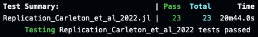

# Tests

This page is dedicated to the presentation of the tests of the package.

Several tests are included in the replication package.
They evaluate all functions loading the required files, and creating the replication output.

The results of the tests should be displayed on top of the GitHub repository.

[](https://github.com/Paulogcd/Replication_Carleton_et_al_2022.jl/actions/workflows/CI.yml?query=branch%3Amain)


However, you can run locally the tests of the package. 
Caution: these tests heavily rely on a file transfer, and it is advised to have a good internet connection to run them.

You can run them locally by entering, in the environment in which you added the replication package:

```
Pkg.test("Replication_Carleton_et_al_2022")
```

They should yield something similar to: 



## Summary of the tests

Since the biggest issue of the replication attempt was data-related, the tests for the package focus on ensuring the availability and management of files required for data analysis and replication of results. The test suite is designed to verify the functionality of loading and deleting specific data files and directories.

The tests are structured to first ensure that the necessary folder structure exists. They then individually load each required file, checking for their existence and downloading them if absent. After confirming the files are present, they are deleted, and their absence is verified. This process is repeated for multiple files, including global mortality panel covariates, public mortality data, figure estimates, and population count covariates.

Also, the tests validate the load() function, which is responsible for loading all required files at once, followed by verifying their presence. The test suite concludes by deleting all files and their associated folders, ensuring the environment is clean post-testing. The tests require a stable internet connection due to the potential need to download large datasets multiple times.
Finally, for each "create" function, as explained earlier in the technical documentation, the tests ensure that the required files are loaded and well created. 